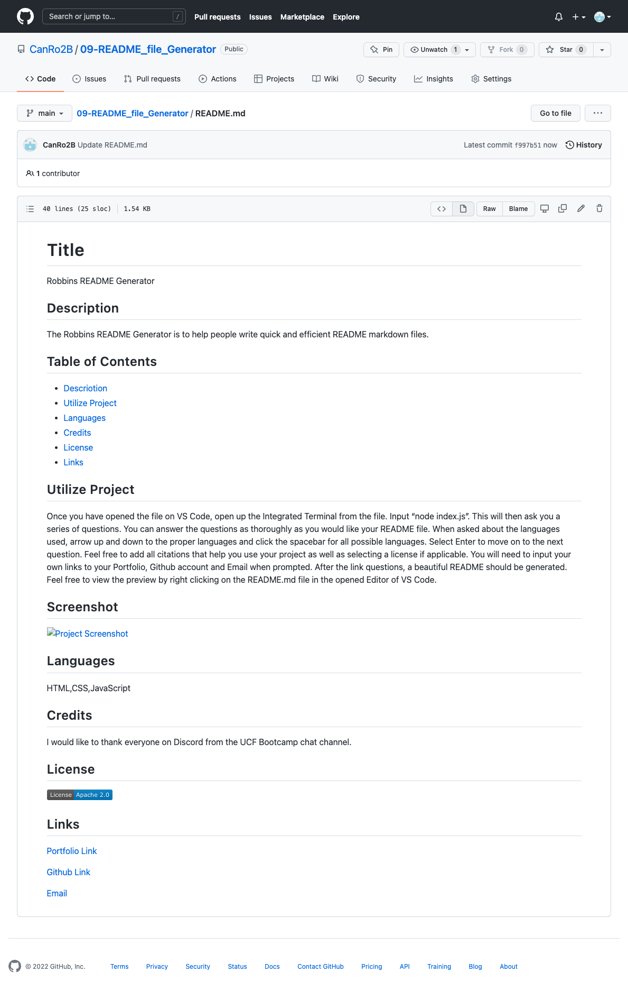

## Title
# Robbins README Generator

## Description
The Robbins README Generator is to help people write quick and efficient README markdown files.

## Table of Contents
- [Description](#description)
- [Utilize Project](#utilize-project)
- [Screenshot](#screenshot)
- [Video Link](#video-link)
- [Languages](#languages)
- [Credits](#credits)
- [License](#license)
- [Links](#links)

## Utilize Project
Once you have opened the file on VS Code, open up the Integrated Terminal from the file.  Input “node index.js”.  This will then ask you a series of questions.  You can answer the questions as thoroughly as you would like your README file.  When asked about the languages used, arrow up and down to the proper languages and click the spacebar for all possible languages.  Select Enter to move on to the next question.  Feel free to add all citations that help you use your project as well as selecting a license if applicable.  You will need to input your own links to your Portfolio, Github account and Email when prompted.  After the link questions, a beautiful README should be generated.  Feel free to view the preview by right clicking on the README.md file in the opened Editor of VS Code.  

## Screenshot

## Video Link
(https://drive.google.com/file/d/1exKYRM8MF030ybvoVRh-sBMHrYypcrdH/view?usp=sharing)
(https://drive.google.com/file/d/1J7F8gLv-X0fdK4onsvk3eIP_jG93mgQl/view?usp=sharing)

## Languages
HTML,CSS,JavaScript

## Credits
I would like to thank everyone on Discord from the UCF Bootcamp chat channel.  

## License

## Links

[Portfolio Link](https://canro2b.github.io/Portfolio/)

[Github Link](https://github.com/CanRo2B)

[Email](hofe36@hotmail.com)

