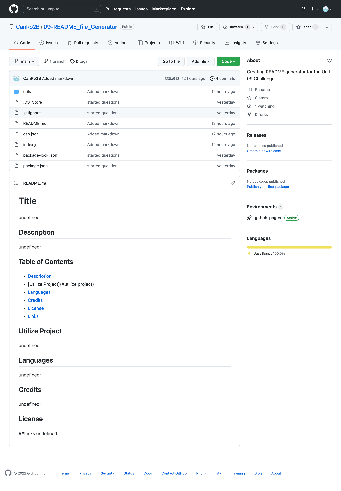

# Title
CA

## Description
CA

## Table of Contents
- [Descriotion](#description)
- [Utilize Project](#utilize-project)
- [Languages](#languages)
- [Credits](#credits)
- [License](#license)
- [Links](#links)

## Utilize Project
CA

## Screenshot

## Languages
HTML,CSS

## Credits
thank you

## License
 https://opensource.org/licenses/MIT

## Links

[Portfolio Link](https://github.com/CanRo2B/gitGud)

[Github Link](https://github.com/CanRo2B/gitGud)

[Email](hofe36@hotmail.com)

